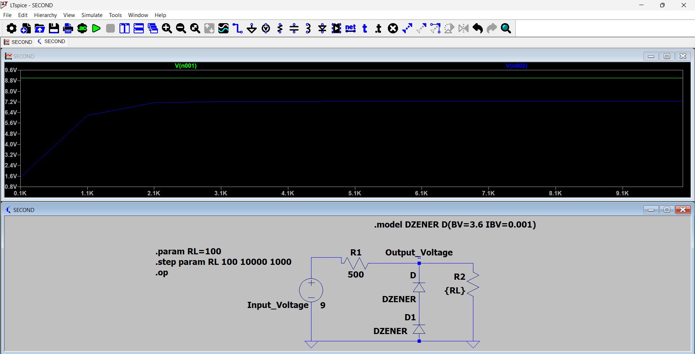
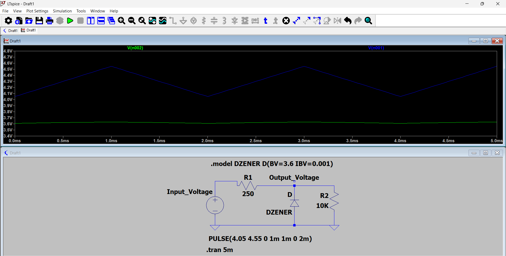
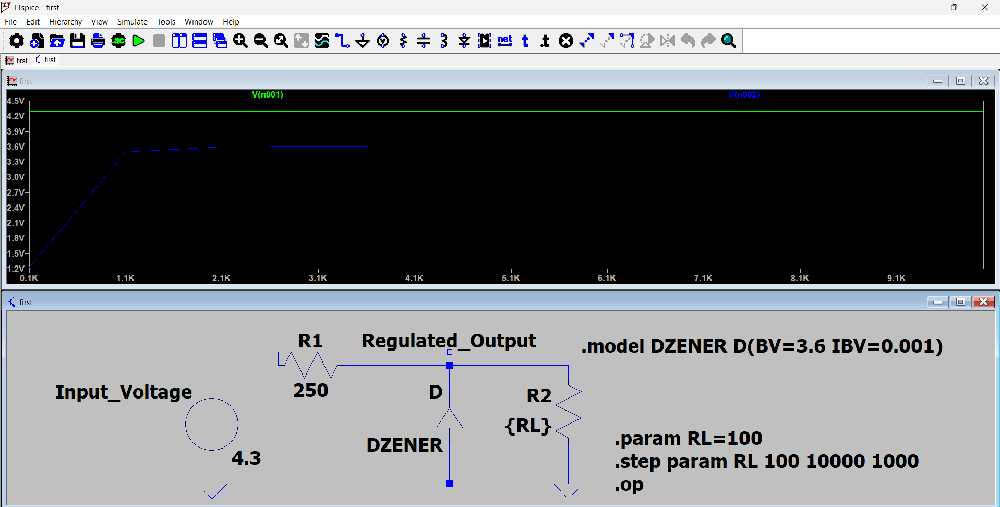

# Zener Voltage Regulator

A complete analog electronics project demonstrating the design, simulation, and practical implementation of a **Zener Diode Voltage Regulator** using **LTspice** and **hardware verification**.

The objective of this project was not only to simulate the circuit but also to understand how voltage regulation changes under different operating conditions through line regulation and load regulation analysis.

The simulated results were further validated using practical hardware implementation and waveform observation with **ADALM1000** and **PixelPulse**.

---

## Project Objectives

- Design a Zener Diode Voltage Regulator.
- Perform Line Regulation Analysis.
- Perform Load Regulation Analysis.
- Analyze voltage regulation under varying operating conditions.
- Compare LTspice simulation with practical hardware implementation.

---

## LTspice Techniques Used

- Transient Analysis (.tran)
- Operating Point Analysis (.op)
- Parameter Sweep (.step param)
- Custom Zener Modeling

---

## Repository Contents

| File | Description |
|------|-------------|
| line-regulation-analysis.asc | LTspice schematic for analyzing the effect of input voltage variation (Line Regulation). |
| load-regulation-analysis.asc | LTspice schematic for analyzing output regulation by varying load resistance. |
| dual-zener-voltage-regulator.asc | LTspice schematic implementing a dual Zener voltage regulator configuration. |

---

## Hardware Verification

The simulated behavior was validated using practical hardware implementation on a breadboard.

Hardware verification was performed using:

- ADALM1000
- PixelPulse
- Breadboard implementation
- Zener Diode
- Resistors
- DC Supply

---

## Experimental Results

### Line Regulation Analysis

Observed how the regulated output responds to variations in input voltage using transient simulation.

### Load Regulation Analysis

Performed parameter sweep analysis by varying load resistance (RL) and studying the regulator behavior.

### Critical Observation

One of the most interesting observations was that proper voltage regulation was not maintained below a certain load resistance range.

As the load resistance increased, the output gradually stabilized near the Zener breakdown voltage, demonstrating the operating region required for effective regulation.

---

## Images

### Circuit Schematic

## Dual Zener Voltage Regulator

---

### LTspice Simulation

## Line Regulation Analysis

## Load Regulation Analysis

---

### Hardware Implementation

## Hardware Implementation

---

### PixelPulse Waveforms

## Experimental Output (PixelPulse)

---

## Demo Video

Project Demonstration:

https://youtu.be/XQnNPkJf-hc
---

## Key Learning Outcomes

This experiment helped me better understand that voltage regulation is **not an ideal phenomenon** and strongly depends on operating conditions such as load resistance and current distribution.

The project connected the complete engineering workflow:

Simulation
→ Circuit Analysis
→ Practical Implementation
→ Hardware Verification
→ Engineering Interpretation

---

## Tools & Components

### Software

- LTspice
- PixelPulse

### Hardware

- ADALM1000
- Breadboard
- Zener Diodes
- Resistors
- Connecting Wires

---

## Author

**Aditya Ojha**

B.S. Electronic Systems  
Indian Institute of Technology Madras

B.Tech Electronics & Telecommunication Engineering  
Jabalpur Engineering College

